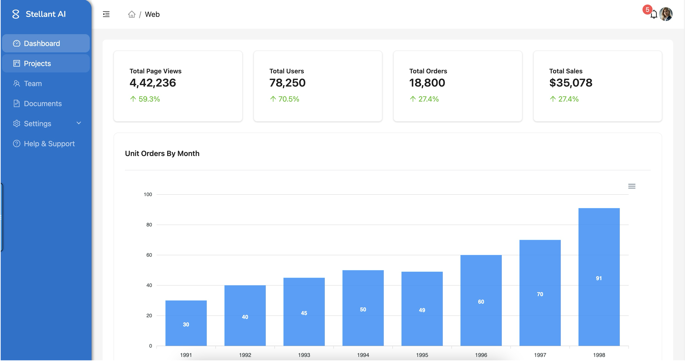
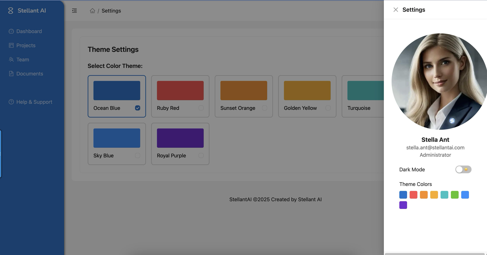

# StellantAI



**StellantAI** is a template and framework for building enterprise-level React applications, specifically designed for chat agents and AI-driven components. Built on top of [Ant Design X](https://github.com/ant-design/x), this template is intended for **rapid prototyping** of web applications and is not recommended for production use.

This project integrates dynamic theme switching, Figma design token support, and AI-assisted React component generation to create flexible, scalable, and visually appealing enterprise-grade applications that are responsive across devices.

---

## Theme Viewing and Switching ##
In order to provide consistent, quickly customizable theming across the application that can be sourced from your design system, this project template is designed to link to your central design theme for the project, or to your design tokens file, or from a Figma project URL. The goal is to  provide a fast and simple approach to creating customizable themes and layouts. 

**Color Theme Design Tokens** are primarily sourced from two locations:

1. The main theme configuration is defined in`/src/theme/themes.ts` which contains the base theme tokens
   
2. Design tokens can also be imported from`/src/designs/DesignTokens.json` which is meant to sync with design tokens exported from Figma.

These files work together with the ThemeProvider component in`/src/theme/ThemeProvider.tsx` to provide consistent theming across the application. The design tokens include colors, typography, spacing, device layouts and other visual elements that can be customized globally or overridden at the component level.  

**Typography Design Tokens** are sourced from the main theme configuration in`/src/theme/themes.ts` and are used to define the typography styles for the application. The typography tokens include font families, sizes, weights, and line heights that can be customized globally or overridden at the component level.

**Spacing Design Tokens** are sourced from the main theme configuration in`/src/theme/themes.ts` and are used to define the spacing styles for the application. The spacing tokens include margins, paddings, and other spacing elements that can be customized globally or overridden at the component level. 



## SAI Core Architecture

StellantAI follows the SAI Core project guidelines, a comprehensive architectural framework designed to create scalable, maintainable, and device-optimized applications.

### What is SAI Core?
SAI Core is an architectural pattern that emphasizes device-specific layouts, shared components, and design token integration. It provides a structured approach to building applications that can seamlessly adapt to different devices while maintaining consistent design and functionality.

### Why SAI Core?
- **Device Optimization**: Dedicated layouts for web, mobile, and tablet ensure optimal user experience across all devices
- **Component Reusability**: Shared component architecture reduces code duplication and maintenance overhead
- **Design System Integration**: Seamless integration with design tokens and Figma workflows
- **Scalability**: Modular structure supports easy addition of new features and device-specific optimizations

### When to Use SAI Core?
- During initial project setup to establish a solid architectural foundation
- When migrating existing projects to support multiple device types
- For projects requiring tight integration between design systems and code
- When building enterprise applications that need to scale across different platforms

### Where is SAI Core Implemented?
The SAI Core architecture is implemented throughout the project structure:
- `/src/app/` - Device-specific layouts (web/, mobile/, tablet/)
- `/src/components/` - Shared component library
- `/src/designs/` - Design tokens and assets
- `/src/theme/` - Theme configurations and customizations

### Who Benefits from SAI Core?
- **Developers**: Clear structure and separation of concerns
- **Designers**: Direct integration with design systems and tokens
- **Product Managers**: Easier feature planning across devices
- **End Users**: Optimized experience for their specific device

---

## Key Features

- **Ant Design X Components**: Built-in enterprise-ready React components for rapid UI development.
- **Dynamic Theme Switching**: Tailwind CSS and Ant Design themes integrated with design tokens from Figma for seamless light/dark mode transitions.
- **Figma to Code Workflow**: Supports exporting design tokens from Figma to Tailwind CSS and generating React components using the [Anima AI Plugin](https://marketplace.visualstudio.com/items?itemName=AnimaApp.vscode-anima).
- **Next.js Integration**: Fully scaffolded with Next.js, offering server-side rendering (SSR) and static site generation (SSG) for scalable web apps.
- **Modern Tech Stack**: Powered by Next.js, Tailwind CSS, and Ant Design, along with support for TypeScript.
- **Beginner-Friendly**: Includes best practices for project organization and guides for new developers.

---

## Tech Stack

| **Technology**   | **Description**                                                              |
|-------------------|------------------------------------------------------------------------------|
| **Next.js**       | React framework for building server-rendered web apps.                      |
| **Ant Design X**  | Enterprise-ready React components with dynamic theming.                     |
| **Tailwind CSS**  | Utility-first CSS framework for highly customizable designs.                |
| **TypeScript**    | Strongly typed JavaScript for more robust development.                      |
| **Figma**         | Design system integration with support for exporting design tokens.         |
| **Anima Plugin**  | Generate React components and JSON design tokens directly from Figma.       |

---

## Project Structure

The project follows a modular and organized structure to facilitate ease of development:

```plaintext
stellantai-x/
├── public/                # Public assets like images, fonts, etc.
├── src/
│   ├── app/               # Next.js application entry (routes/pages)
│   │   ├── layout.tsx     # Layout component for global app structure
│   │   ├── page.tsx       # Main page (homepage)
│   ├── components/        # Shared React components
│   ├── theme/             # Theme configurations (e.g., Tailwind + Ant Design tokens)
│   │   └── themeConfig.ts # Centralized design tokens and theme customization
│   ├── styles/            # Global styles (CSS, Tailwind configurations)
│   ├── utils/             # Utility functions
├── .gitignore             # Git ignored files
├── README.md              # Project documentation
├── package.json           # Project dependencies and scripts
└── tsconfig.json          # TypeScript configuration
```

---

## Getting Started

### Prerequisites

Ensure you have the following installed:
- **Node.js** (version 16 or later)
- **npm** (or an alternative like Yarn)

### Installation

1. Clone the repository:

   ```bash
   git clone https://github.com/StarServeai/stellantai-x.git
   cd stellantai-x
   ```

2. Install dependencies:

   ```bash
   npm install
   ```

3. Start the development server:

   ```bash
   npm run dev
   ```

4. Open [http://localhost:3000](http://localhost:3000) in your browser to view the app.

---

## Design to Code Workflow

1. **Create Designs in Figma**:
   - Use Figma to design components and pages.
   - Define design tokens for colors, typography, and spacing.

2. **Export Design Tokens**:
   - Use a Figma plugin (e.g., [Figma Tokens](https://www.figma.com/community/plugin/843461159747178978)) to export tokens as JSON.

3. **Integrate Tokens with Tailwind CSS**:
   - Add design tokens to Tailwind CSS configuration for consistent styling.

4. **Generate React Components**:
   - Use the [Anima AI Plugin](https://marketplace.visualstudio.com/items?itemName=AnimaApp.vscode-anima) to convert Figma designs into React components.

5. **Integrate Components into StellantAI**:
   - Import and style generated components using Tailwind CSS and Ant Design X.

---

## Theming and Customization

StellantAI supports **dynamic theme switching** using Tailwind CSS and Ant Design X tokens.

- **Light/Dark Modes**:
  - Easily switch between themes using the theme toggler built into the app.
- **Customizing Tokens**:
  - Modify `themeConfig.ts` to update global design tokens such as `colorPrimary` or `fontSize`.

Example snippet from `themeConfig.ts`:
```typescript
const theme: ThemeConfig = {
  token: {
    fontSize: 16,                // Base font size
    colorPrimary: '#0070f3',     // Primary theme color
    colorTextSecondary: '#595959', // Secondary text color
    colorFillSecondary: '#f0f0f0', // Secondary background fill
  },
};
export default theme;
```

---

## Deployment

### Deploying on Vercel

The easiest way to deploy your app is via [Vercel](https://vercel.com/).

1. Link your GitHub repository to Vercel.
2. Push your changes to the `main` branch.
3. Vercel will automatically build and deploy your app.

For manual deployment, refer to [Next.js deployment documentation](https://nextjs.org/docs/deployment).

---

## Resources for Learning React & Next.js

- **React Official Documentation**: [React Docs](https://reactjs.org/docs)
- **Next.js Official Documentation**: [Next.js Docs](https://nextjs.org/docs)
- **Ant Design X**: [Ant Design X Docs](https://ant.design/docs/react/introduce)
- **Tailwind CSS**: [Tailwind Docs](https://tailwindcss.com/docs)
- **Figma**: [Figma Learn](https://www.figma.com/resources/learn-design/)

---

## Contribution Guidelines

Contributions are welcome! Please fork the repository and create a pull request for any features, bug fixes, or enhancements.

1. Fork the repository.
2. Create a feature branch: `git checkout -b feature-name`.
3. Commit your changes: `git commit -m "Description of changes"`.
4. Push to the branch: `git push origin feature-name`.
5. Open a pull request.
