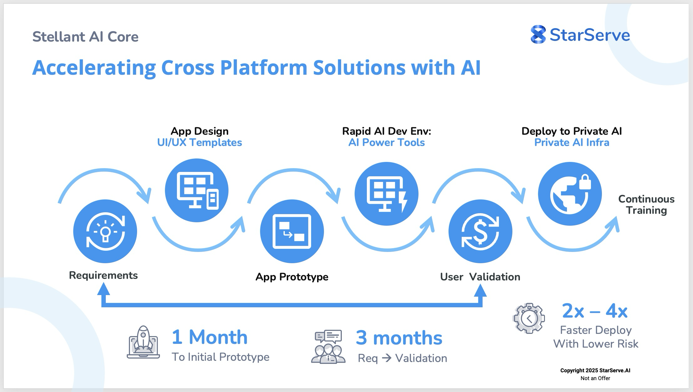

# StellantAI Core Specification


## **Summary**
StellantAI Core (SAI Core) is provided as a modular, scalable, and cross-platform project structure designed for modern AI applications.  

Start with a centralized design, theme, and layout that can be deployed globally on virtually any device, cloud or network. 

IMPORTANT NOTE:  This is a development project with minimal testing and support.

Please engage a professional developer or development org for assistance!

---

## **Problem**
Developers often face challenges when managing **multiple frameworks, layouts, and components** in a single project:
- **Duplication** of assets and themes across frameworks (e.g., React, HTML, Tailwind).
- **Difficulty** in maintaining visual consistency between TSX (React) and static HTML pages.
- **Lack of reusable design tokens** for seamless Figma-to-code integration.
- **Fragmented and isolated projects across multiple frameworks** Multiple  projects, designs and assets across web, mobile apps, PWAs, and desktops.

---

## **Solution**
SAI Core provides a **modular, reusable, and scalable project structure** that:
- Shares assets, themes, and components across React and HTML environments.
- Integrates **design tokens** (JSON) for consistent styling based on Figma designs.
- Offers a flexible base for creating variants using popular frameworks like Tailwind CSS, Material UI, ShadCN, and more.
- Supports integration with tools like **Next.js**, **Vite**, or React Native.

---

## **Benefits**
- **Efficiency**: Shared assets and components reduce development time and redundancy.
- **Flexibility**: Easily adapt to different frameworks, layouts, and designs.
- **Consistency**: Ensure a unified design and experience across environments.
- **Scalability**: Extend to mobile apps, PWAs, and other project types.
- **Open Source**: Accelerate app development for beneficial solutions with an MIT license.

---

## **Overview**
The SAI Core cross platform project structure is designed with the following key principles:
- **Rapid AI Development**:  Design, prototype, build and deploy rapidly to nearly any device, cloud or network
- **Shared Components and Assets**: Centralize reusable components, styles, and images.
- **Framework Agnostic**: Supports React, HTML, and CSS frameworks like Tailwind and Bootstrap.
- **Design Integration**: Includes `designs/` for Figma files and JSON-based design tokens.
- **Modular Layouts**: Layouts designed for both TSX and static HTML rendering.
- **Future-proof**: Can be extended for mobile apps (React Native) or PWAs.
- **Open Source**:  AI isn't for anyone unless it's open to everyone.

---

## **Folder Structure**

Below is the comprehensive folder structure, including placeholders for files and device-specific layouts to assist developers in understanding how to use and extend the project.
Note that this first variant is based on Ant Design, Ant Design open source components, and Figma design files for Ant Design on next.js.  

However, the SAI Core project structure is generic to allow variants for different components and layouts such as bootstrap, tailwind, material UI, ShadCN and many more. 

### **SAI Core Project Structure**
```
StellantAICore/
├── public/                     # Shared public assets
│   ├── images/                 # Shared images (e.g., logos, icons)
│   ├── styles/                 # Shared stylesheets
│   │   ├── global.css          # Global styles for the project
│   │   ├── bootstrap.css       # Bootstrap-specific styles
│   │   ├── AntDesign.css       # Ant Design-specific styles
│   │   └── components.css      # Shared component styles
│   ├── static-html/            # Static HTML pages for device-specific views
│   │   ├── index.html          # Lists all available HTML pages
│   │   ├── dashboard-web.html  # Static Web layout for Dashboard
│   │   ├── dashboard-mobile.html # Static Mobile layout for Dashboard
│   │   ├── dashboard-tablet.html # Static Tablet layout for Dashboard
│   │   └── ...
│   └── favicon.ico             # Favicon for the project
├── src/
│   ├── app/                    # Next.js app pages and layouts
│   │   ├── web/                # Web-specific layouts and views
│   │   │   ├── dashboard-web.tsx      # Web layout for Dashboard
│   │   │   ├── dashboard-web.module.css # Styles for Web Dashboard
│   │   │   └── ...
│   │   ├── mobile/             # Mobile-specific layouts and views
│   │   │   ├── dashboard-mobile.tsx   # Mobile layout for Dashboard
│   │   │   ├── dashboard-mobile.module.css # Styles for Mobile Dashboard
│   │   │   └── ...
│   │   ├── tablet/             # Tablet-specific layouts and views
│   │   │   ├── dashboard-tablet.tsx   # Tablet layout for Dashboard
│   │   │   ├── dashboard-tablet.module.css # Styles for Tablet Dashboard
│   │   │   └── ...
│   │   └── layouts/            # Shared layout components for all devices
│   │       ├── WebMainLayout.tsx      # Shared Web layout
│   │       ├── WebMainLayout.module.css # Styles for Web layout
│   │       ├── TabletMainLayout.tsx   # Shared Tablet layout
│   │       ├── TabletMainLayout.module.css # Styles for Tablet layout
│   │       ├── MobileMainLayout.tsx   # Shared Mobile layout
│   │       ├── MobileMainLayout.module.css # Styles for Mobile layout
│   ├── components/             # Reusable React components
│   │   ├── Button.tsx          # Button component
│   │   ├── Card.tsx            # Card component
│   │   └── ...
│   ├── theme/                  # Theme-related files
│   │   ├── ThemeProvider.tsx   # Provides themes to components
│   │   ├── themeConfig.ts      # Configuration for themes
│   ├── designs/                # Design files and tokens
│   │   ├── DesignTokens.json   # JSON-based design tokens for consistent styles
│   │   ├── DesignFile.fig      # Placeholder for Figma design files
│   └── utils/                  # Utility functions
│       ├── constants.ts        # Shared constants
│       ├── responsive.ts       # Utility functions for responsive design
│       └── ...
├── deployments/                # Deployment configurations for various environments
│   ├── next/                   # Next.js-specific configuration
│   │   └── settings.json
│   ├── vite/                   # Vite-specific configuration
│   │   └── vite.config.js
│   ├── expo/                   # Expo.dev configuration for mobile
│   │   └── settings.json
│   ├── vercel/                 # Vercel-specific deployment configuration
│       └── vercel.json
├── StaticServer/               # Static HTML server
│   └── server.js               # Server script for serving static HTML files
├── package.json                # Project dependencies
├── tsconfig.json               # TypeScript configuration
├── next.config.js              # Next.js configuration
└── README.md                   # Documentation for the project
```

---

## **Key Features**
1. **Centralized Assets**:
   - Shared styles, themes, and images are stored in the `public/` folder for reuse across devices and layouts.
   - Design tokens (`DesignTokens.json`) ensure consistent styles across all platforms.

2. **Cross-Device Views**:
   - Separate folders under `src/app/` for **Web**, **Mobile**, and **Tablet** views with a unified naming convention (`<page-name>-<device>.tsx`).

3. **Reusable Layouts**:
   - Layouts (`WebMainLayout.tsx`, `TabletMainLayout.tsx`, `MobileMainLayout.tsx`) are shared across pages but allow for device-specific overrides.

4. **Cross-Platform Development**:
   - Supports React/TypeScript (via Next.js) and Static HTML with parallel file naming for seamless mapping.

---

## **File Naming Conventions**
- **Static HTML Pages**: `<page-name>-<device>.html` (e.g., `dashboard-web.html`).
- **TypeScript/React Components**: `<page-name>-<device>.tsx` (e.g., `dashboard-web.tsx`).
- **Styles**: `<page-name>-<device>.module.css` (e.g., `dashboard-web.module.css`).

---

## SAI Core **Variants**
SAI Core is designed to support multiple frameworks, layouts, and designs.  It also allows designers and developers a structure to compare JS/TS app pages with their corresponding HTML static pages.
Why compare JS/TS with HTML pages?  Often designers need a way to view a design quickly without heavy coding effort.  HTML with CSS is often easier than coding JS/TS.
SAI Core has HTML friendly core themes, styles, layout and component framework variants: 

In the future we'll post SAI Core Variants that provide support for additional frameworks and components like below.  
Meanwhile, here are some tips on how to test out SAI Core for these variants:

1. **CSS Frameworks**:
   - **Tailwind CSS Variant | SAI Tailwind Veriant**:  Test it out--using SAI Core, replace AntDesign CSS with Tailwind's utility-first classes.  More below.
  
   - **Bootstrap Variant | SAI Bootstrap**: Test it out--using SAI Core, Use Bootstrap grid and components for both TSX and HTML.

2. **Component Libraries**:
   - **Material UI Variant**: Replace AntDesign components with Material UI components.
   - **ShadCN Variant**: Use ShadCN components with Tailwind integration.

3. **Project Types**:
   - **React Native Variant**: Extend SAI Core for mobile apps using React Native.
   - **PWA Variant**: Create Progressive Web Apps with Next.js or Vite.
  
## Tailwind CSS Variant Guidance ##
	•	Install Tailwind:
   ```
   npm install -D tailwindcss postcss autoprefixer
npx tailwindcss init
```
•	Update tailwind.config.js for shared content paths.
•	Replace global.css with Tailwind utility classes.

NOTE:  As of this writing, Tailwind CSS variant has not been fully tested.

---

## **Setup Steps and Usage**
### **Step 1: Clone the Repository**
```bash
git clone https://github.com/starserveai/SAICore.git
cd SAICore

---

## **Usage**
1. **Clone the repository**:
   ```bash
   git clone <repo_url>
   cd SAICore
   npm install
   ```

2. **Run the project**:
   - **React/Next.js**:
     ```bash
     npm run dev
     ```
   - **Static HTML Server**:
     ```bash
     node StaticServer/server.js
     ```

3. **Add pages**:
   - Create new files under `src/app/<device>/` and `public/static-html/` following the naming conventions.

---

## **Contributing**
We welcome contributions! Please fork the repository, make changes, and submit a pull request.